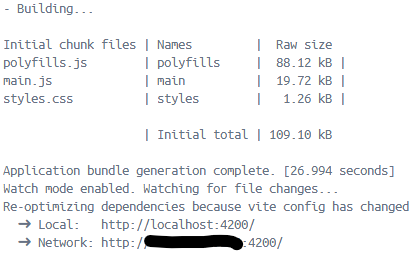
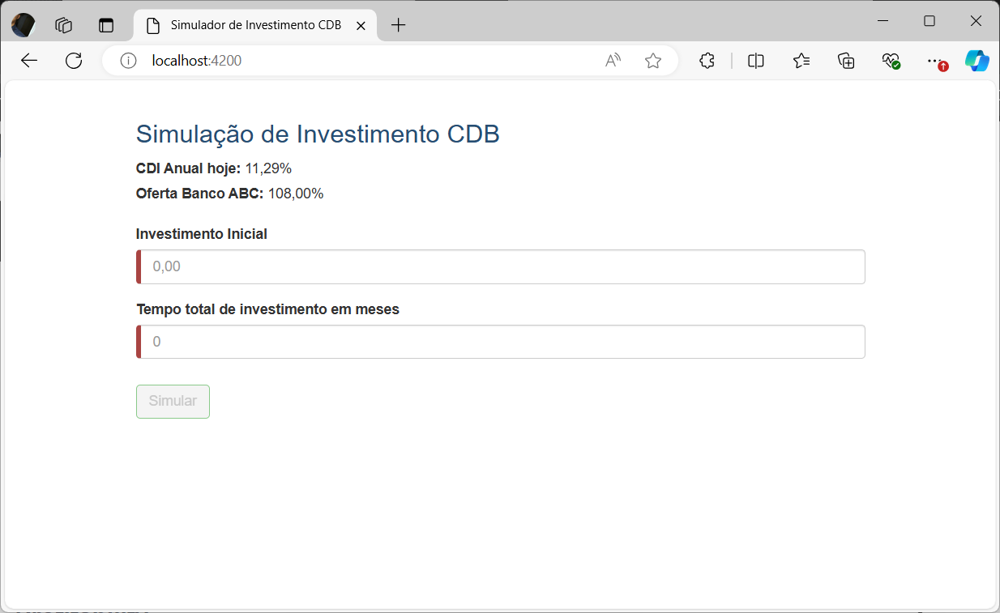

# B3 Test
## Intenção
Este projeto é uma aplicação que executa a simulação do rendimento do CDB de um investimento inicial em relação a x tempos em meses.

## Inicialização do Projeto
Para iniciar o projeto há duas formas: 
* Via Docker
	* A vantagem do Docker é que ferramentais de log e telemetria sobem junto com a aplicação. Com isso poderá ser atestada a observabilidade da aplicação. 
* Inicialização Local Pelo Visual Studio
	* Nesse caso não terá todo um ambiente para a validação da observabilidade.

Um ponto que vale a atenção é que tanto a inicialização via Docker, quanto inicialização local, ambas vão compartilhar das mesmas portas para as aplicações. Com isso é necessário matar por completo o container criado dentro do Docker para que não haja concorrência de porta da aplicação, caso alterne entre as opções.

### Docker
Na raiz do projeto, assim que feito o pull request, abra o terminal e execute o comando abaixo.  
```bash
docker-compose up -d
```


*Obs: Como visto na imagem os containers ficam com status de Started, contudo não é nesse momento que de fato a aplicação está de pé, para tal é necessário que seja encontrado o log visto na imagem abaixo do container **b3test-b3.test.frontend** no  Docker Desktop*




*Obs 2: Em toda reinicialização do docker, sempre e antes de nova inicialização **exclua o diretório DockerAppFiles** criado na raiz do projeto.*

#### Acesso
* [Simulador de Investimento CDB](http://localhost:4200/)
* [Swagger WebApi](http://localhost:32805/swagger/index.html)

### Inicialização Local Vis Visual Studio
Abra a Solution do projeto Visual Studio, em seguida clique com botão direito sobre o projeto **B3.Test-FrontrEnd** navegue no menu até Open In Terminal (Abrir no Terminal). Irá inicializar o PowerShell do Desenvolvedor no Visual Studio. 
Digite a sequencia de comandos abaixo:
* O comando abaixo irá instalar o Angular Client
```bash
npm install -g @angular/cli
```

* O comando abaixo irá forçar a instalação das dependências dos projeto.
```bash
npm install --force
```
* O comando abaixo vai iniciar a aplicação frontend no endereço *http://localhost:4200*
```bash
ng serve
```
Visual Studio:


Com isso a aplicação em Angular irá iniciar na porta *4200*. Com isso o FrontEnd está inicializado, falta a WebApi.
Para a WebApi, set o **B3.Test-WebApi** como Startup, inicie o projeto com o profile http. Agora sim tudo finalizado.


#### Acesso
* [Simulador de Investimento CDB](http://localhost:4200/)
* [Swagger WebApi](http://localhost:32805/swagger/index.html)

## Testes
### Teste Funcional
Para execução de negócio acesse [Simulador de Investimento CDB](http://localhost:4200/) deverá ser vista a tela como na imagem abaixo:



* Preencha o **Investimento Inicial** com um valor numérico não menor que 1
* Preencha o **Tempo total de investimento em meses** com um valor numérico não menor que 1
* Caso os campos estejam preenchido com valores validos o botão **Simular** estará habilitado, como visto na imagem abaixo.
	* Clique no botão **Simular**


Ao clicar no botão **Simular** a tela deverá se comportar de acordo com a imagem abaixo, apresentando uma tabela de previsões com a quantidade de linhas correspondente ao valor preenchido no campo **Tempo total de investimento em meses**, nesse caso, foi o valor 4.


### Testes Unitários
Abra a Solution do projeto e executes os teste unitário. Ao final deverá estar de acordo com a imagem abaixo:


## Banco de Dados
* ElasticSearch

## Observabilidade
A observabilidade em aplicações refere-se à capacidade de compreender e monitorar efetivamente o comportamento interno e o desempenho de um sistema em tempo real. Para tal adaptei o código para atender a esses conceitos e utilizei de algumas ferramentas, sendo:
* Kibana
    * Visualização dos logs
    * Ao executar pela primeira vez, por mais que existam dados de log, a visualização destes só será possível por meio de index. Então ao ir em *discover do Kibana*, haverá um redirecionamento para a tela de criação.  O nome do index é **b3_test_index**, crie e assim a visualização do logs acontecerá.
    * [Home - Elastic](http://localhost:5601/app/home#/)
* Telemetria - Jaeger
    * [Jaeger UI](http://localhost:16686/search)

## Premissas
Seguindo os princípios do bom desenvolvimento de software, construí este projeto com ênfase na arquitetura da solução e da aplicação. A análise do código revela uma separação em camadas bem definida, onde a camada de domínio, responsável pelas regras de negócio, é acessada exclusivamente por meio de interfaces bem definidas, chamadas de portas e o componente que apoia a lógica de negócio se adapta a essas portas. Essa abordagem, conhecida como **arquitetura hexagonal**, promove a independência da lógica de negócio em relação às tecnologias e frameworks utilizados, facilitando testes, manutenabilidade e reuso de código. O projeto também **incorpora os princípios SOLID**, um conjunto de boas práticas que garantem a coesão e baixo acoplamento. Essa combinação resulta em um código mais robusto, flexível e fácil de entender. 
Para garantir a qualidade do código segui **conceitos do Clen Code** e **realizei testes unitários** com alta cobertura, como visto na imagem abaixo.

 


## Conteinerização
A aplicação foi projetada com orquestração de containers em mente, facilitando a implantação e o gerenciamento de ambientes escaláveis. A viabilidade de orquestração foi validada por meio de testes com o Docker Compose, demonstrando potencial para utilização em produção com ferramentas como o Kubernetes.
